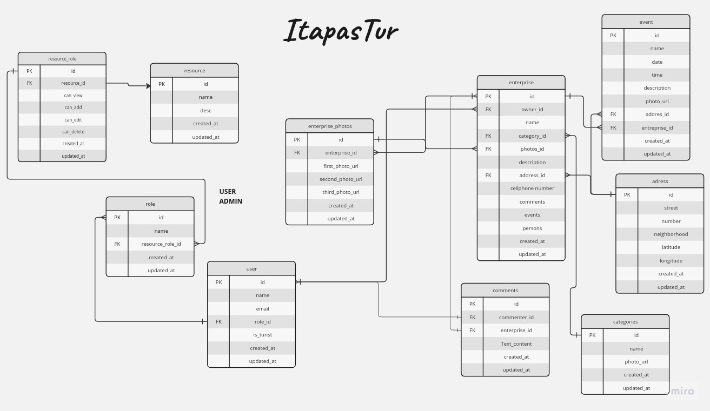

## Sobre ℹ️
O backend do ItapasTur foi desenvolvido utilizando a linguagem Ruby juntamente com o framework Ruby on Rails, foi utilizado uma API seguindo o padrão MVC do rails, porém, sem utilizar as views, visto que é uma API

## Tecnologias 💻
Essas são as tecnologias utilizadas na API:
-  -> Banco de dados relacional principal.
-  -> Framework web.
  -  -> Utilizado para modularização.
  -  -> Utilizado para encodificar e decodificar tokens jwt.
  -  -> Utilizado para encriptar senhas.
  -  -> Utilizado para conectar com o S3 da AWS.

## Diagrama do Banco de Dados


## Rotas 🛤️
As notas rotas podem ser vistas através da documentação do Postman:
- [Rotas](https://web.postman.co/documentation/27353559-14b0b971-9c0a-4118-b19e-059f3dc4d214/publish?workspaceId=d7e30ca3-6042-491f-81aa-fba41b13f8b8)
  
## Rodando o Projeto 🚀

- Caso possua o Ruby, o Rails e o Postgresql, utilize os seguintes comandos abaixo:

1. Clone o repositório:
```
git clone -b develop https://github.com/StudentSync/StudentSync-api
cd StudentSync-api
```
2. Instale as dependências:

```
bundle install
```

3. Configure o banco de dados:

```
rails db:setup
```

4. Inicie o servidor:

```
rails s
```

- Com isso o projeto estará rodando na URL 'localhost:3000'
